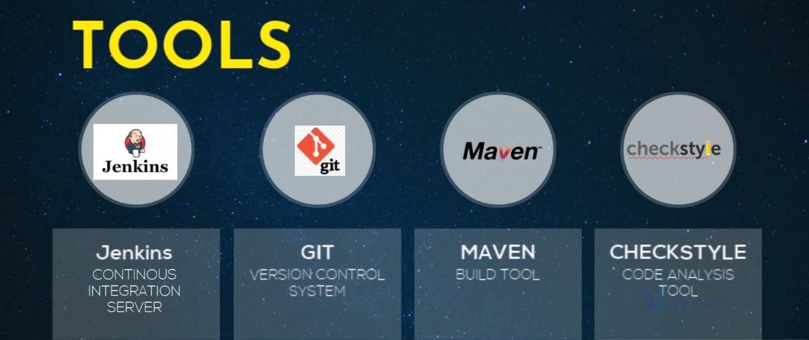
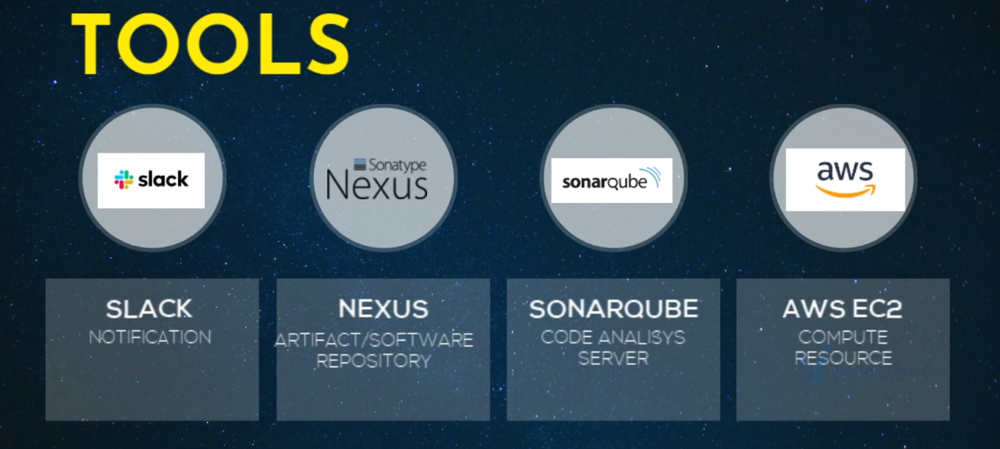
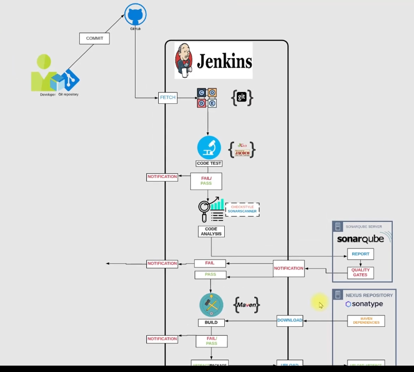
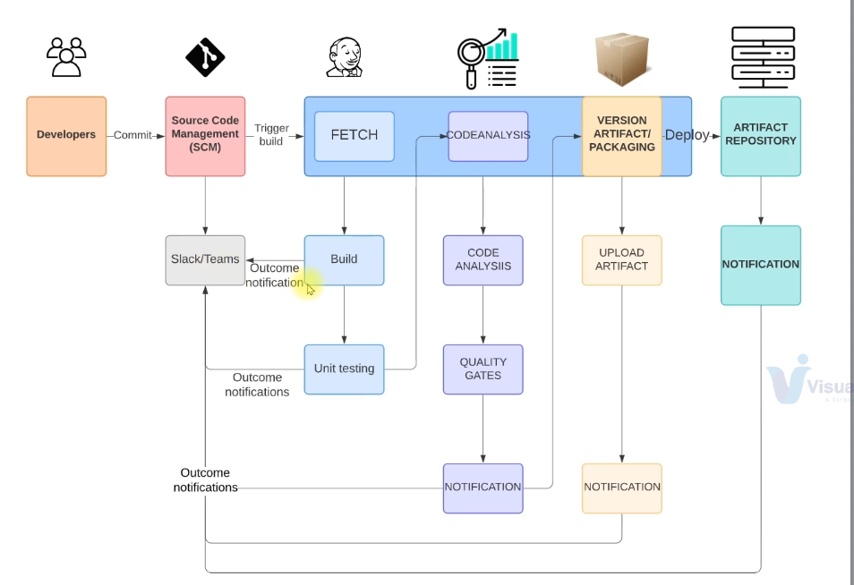

# CI-CD-Pipeline-Project-using-Jenkins-Nexus-Sonarqube-Slack

## Description

The aim of this project is to automate the manually progressing project development processes and to provide continuous integration and delivery by reducing the errors that may occur with less human intervention. This project aims to deploy Visual Profile Maven Project to Nexus repository with CI/CD Jenkins using  Sonarqube, Nexus,GİT/Github,Slack and AWS EC2 instance. 

## Tools is Used For This Project

## Project Architecture

## Scenario

You have a product development and agile SDLC is in motion, so a bunch of smart developers in an agile team will regularly make changes. So there'll be multiple code changes every day. And all this code needs to be tested because this is what actually is building your product. 

- This code needs to be regularly built and tested. usually in an enterprise, there will be a separate building release team will be doing this job of building, testing and releasing the code, or if it's a small industry, then they'll be it will be developer's responsibility to merge and integrate this code.

- There are regular quote changes also called comments or pull requests, developers will be dependent on building the team, usually to test the code and move it to the next level in the release cycle. 

- The code will be tested if there are any bugs or whether it will be known late due to these bugs and errors in the code. Keep accumulating and let's say these got accumulated. A problem goes much deeper now, developers need to rework to fix these bugs and errors, which is time consuming process and seems would be already approaching the deadline.

## Current Situation

- Agile SDLC
- Developers make regular code changes
- These commits needs to be Build & Tested
- Usually Build & Release Team will do this Job
- Or Developers responsibility to merge an integrate code

## Issues with Current Sıtuation

- In an Agile SDLC, there will be be frequent code changes
- Not so frequently code will be tested
- Which accumulates bugs and error in the code
- Developers need to rework to fix these bugs and error
- Manual Build & Release process
- Inter Team Dependencies

## Solution of This Problem

1. Build & Test for every commit
2. Automated Process
3. Notify For Every Build Status
4. Fix Code İf bugs or error found instantly rather than waiting

Solution to this problem is a regular build and test for every comet, so as soon as there is a code change, the code needs to be built and tested at the same time. 

-  İf the process is manual, this will not be possible. you need to have an automated building release process. 

-  Whenever there is a big and test of the court, the developers should get notified automatically. if you have such kind of automation framework in place, which will regularly build and test the code for every comic, then you're also removing dependency of developers from building steam. 

-  This process itself is called continuous integration process. So input to this process is any good comic and output will be well tested artifact and all this will happen automatically.

## Project Steps

İn this project, obviously, we're going to set up a continuous integration pipeline:
- Starting with Jenkins, Jenkins will be our continuous integration server and main hero in this project
and as hero needs sidekick, our jenkins' hero will also need some assist in tool.
- We are going to use a version control system, we going to use Git and GitHub as the remote repository, and we have a Java code in that. And to build that Java code, we will need build tool even.
- We are also going to do some cool analysis, so we are going to use forced check style, which is a very simple core analysis tool.
- There are more sidekicks, there are more tools, they'll use slack for notification. We can also have an email integration, so we get email notifications.
- We'll use Nexxus, a sonar type to store our artifact and also to download dependancy form.sonar nexxus will be our software repository.
- We're going to get more deeper into your analysis, so we'll be using Sonarqube Server.
- And to set up these servers, jinking server, Nexus server, Sonarqube server, we are going to use  platform will use EC2 instances on AWS, two instances will set up jenkins server,Nexus server, Sonarqube server.

## Objective
GOALS
 - Fault Isolatıon
 - Short MTTR (Mean Time to Recovery)
 - Fast turn around on feature changes
 - Less Disruptive

## Continuous Integration Pipeline Architecture

You'll have a very clear understanding what we are trying to achieve. Let's see the workflow:

- First, developer makes a code change, commit to one control system or source code manager and automation tool will automatically fetch that code, build it, run a unit test and return the outcome on slack channel. And so we'll be using slack anyways.

- The next, Phase will be it will codeanalysis and analysis, there will be  quality gates if the threshold if it is not passing the threshold gap, then it's good.

- If it's passing the threshold, then a notification will be sent on like channel.Then the software will be built, it will be packaged and the artifact will be uploaded and its outcome notification will be also sent.

- The artifact or the software will be stored in the artifact repository, if all these stages are successful, then the software can be promoted to the next level. If there is any failure, the notification will be any anyways sent.

- Once the notification is received by the developer for any failure they will make, the code will make the fix and the process repeats again.

- There will be regular code commits, continuous code commits, and this process will run continuously. that's why the need continuous continuous integration. This process will be automated, so this can be done multiple times in a day if you want.

## Flow of Execution 

1. Login to AWS account
2. Cereate login key
3. Create Security Groups for three server:
    - Jenkins
    - Nexus
    - Sonarqube
4. Create EC2 instances with userdata
    - Jenkins
    - Nexus
    - Sonarqube
5. Jenkins Post Installation
6. Nexus Repository Setup
    - Create 3 repos
7. Sonarqube post installation
8. Jenkins Steps
    - Build job
    - Setup Slack Notification
    - Checkstyle code analysis job
    - Setup Sonar integration
    - Sonar code analysis job
    - Artifact upload job
9. Connect all jobs together with Buildpipeline
10. Set automatic build trigger
11. Test with intellij, VScode etc.
12. Cleanup resources.